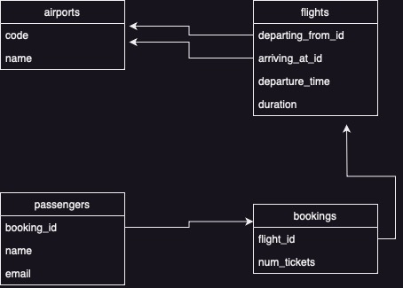
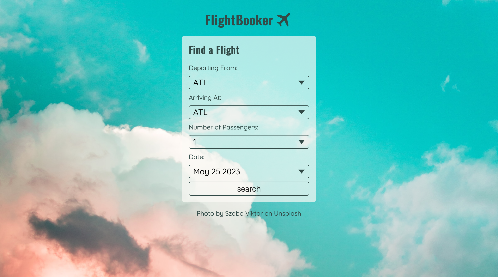
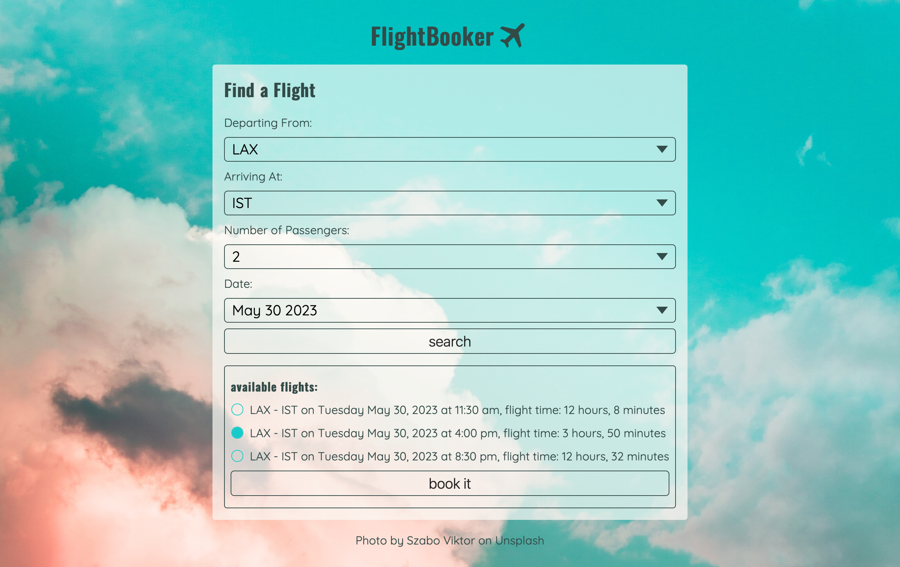
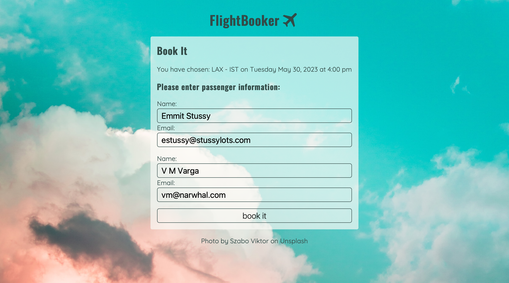
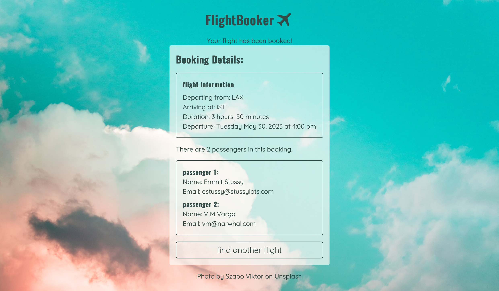

# Flight Booker

This is a solution to the [Flight Booker](https://www.theodinproject.com/lessons/ruby-on-rails-flight-booker) project from the [Odin Project's](https://www.theodinproject.com/) Rails path. 

## Features

A nested form that makes use of #accepts_nested_attributes_for that creates all of the passengers associated with a booking at once. 

## The database

## Screenshots

The home page.

After a flight search has occurred. 

The new booking page.

The page loaded once a user has created a successful booking. 

